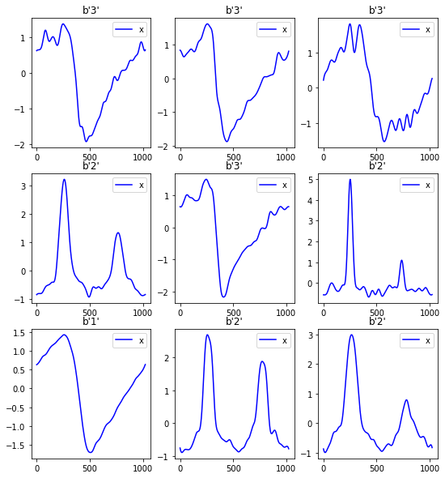
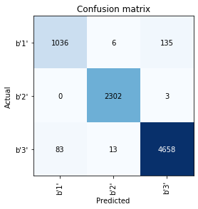

# timeseries_fastai
> This repository aims to implement TimeSeries classification/regression algorithms. It makes extensive use of fastai training methods.


## Installation

In short, if you have anaconda, execute:

`$ pip install fastai_timeseries`

and you are good to go.

## Time Series Classification from Scratch with Deep Neural Networks: A Strong Baseline
The original paper repo is [here](https://github.com/cauchyturing/UCR_Time_Series_Classification_Deep_Learning_Baseline) is implemented in Keras/Tf.

- Notebook 01: This is a basic notebook that implements the Deep Learning models proposed in [Time Series Classification from Scratch with Deep Neural Networks: A Strong Baseline](https://arxiv.org/abs/1611.06455). 

## InceptionTime: Finding AlexNet for Time SeriesClassification
The original paper repo is [here](https://github.com/hfawaz/InceptionTime)

- Notebook 02: Added InceptionTime architecture from [InceptionTime: Finding AlexNet for Time SeriesClassification](https://arxiv.org/pdf/1909.04939.pdf). 

## Results

You can run the benchmark using:

`$python ucr.py --arch='inception' --tasks='all' --filename='inception.csv' --mixup=0.2`

### Default Values:
- `lr` = 1e-3
- `opt` = 'ranger'
- `epochs` = 40
- `fp16` = True

```python
import pandas as pd
from pathlib import Path
```

```python
results_inception = pd.read_csv(Path.cwd().parent/'inception.csv', index_col=0)
results_inception.head(10)
```


<div>
<style scoped>
    .dataframe tbody tr th:only-of-type {
        vertical-align: middle;
    }

    .dataframe tbody tr th {
        vertical-align: top;
    }

    .dataframe thead th {
        text-align: right;
    }
</style>
<table border="1" class="dataframe">
  <thead>
    <tr style="text-align: right;">
      <th></th>
      <th>acc</th>
      <th>acc_max</th>
      <th>train_loss</th>
      <th>val_loss</th>
    </tr>
    <tr>
      <th>task</th>
      <th></th>
      <th></th>
      <th></th>
      <th></th>
    </tr>
  </thead>
  <tbody>
    <tr>
      <th>Adiac</th>
      <td>0.83</td>
      <td>0.83</td>
      <td>1.54</td>
      <td>1.31</td>
    </tr>
    <tr>
      <th>ArrowHead</th>
      <td>0.84</td>
      <td>0.89</td>
      <td>0.47</td>
      <td>0.60</td>
    </tr>
    <tr>
      <th>Beef</th>
      <td>0.57</td>
      <td>0.60</td>
      <td>1.22</td>
      <td>1.27</td>
    </tr>
    <tr>
      <th>BeetleFly</th>
      <td>0.85</td>
      <td>1.00</td>
      <td>0.29</td>
      <td>0.38</td>
    </tr>
    <tr>
      <th>BirdChicken</th>
      <td>0.80</td>
      <td>0.95</td>
      <td>0.25</td>
      <td>0.55</td>
    </tr>
    <tr>
      <th>Car</th>
      <td>0.85</td>
      <td>0.85</td>
      <td>0.58</td>
      <td>0.74</td>
    </tr>
    <tr>
      <th>CBF</th>
      <td>0.99</td>
      <td>1.00</td>
      <td>0.44</td>
      <td>0.37</td>
    </tr>
    <tr>
      <th>ChlorineConcentration</th>
      <td>0.77</td>
      <td>0.77</td>
      <td>0.61</td>
      <td>0.70</td>
    </tr>
    <tr>
      <th>CinCECGTorso</th>
      <td>0.65</td>
      <td>0.68</td>
      <td>0.64</td>
      <td>1.06</td>
    </tr>
    <tr>
      <th>Coffee</th>
      <td>1.00</td>
      <td>1.00</td>
      <td>0.33</td>
      <td>0.21</td>
    </tr>
  </tbody>
</table>
</div>


## Getting Started

```python
from timeseries_fastai.imports import *
from timeseries_fastai.core import *
from timeseries_fastai.data import *
from timeseries_fastai.models import *
```

```python
ucr_path = untar_data(URLs.UCR)
```

```python
df_train, df_test = load_df_ucr(ucr_path, 'StarLightCurves')
```

    Loading files from: /home/tc256760/.fastai/data/Univariate2018_arff/StarLightCurves


```python
df = stack_train_valid(df_train, df_test)
```

```python
x_cols = df.columns[0:-2].to_list()
```

```python
df.head()
```


<div>
<style scoped>
    .dataframe tbody tr th:only-of-type {
        vertical-align: middle;
    }

    .dataframe tbody tr th {
        vertical-align: top;
    }

    .dataframe thead th {
        text-align: right;
    }
</style>
<table border="1" class="dataframe">
  <thead>
    <tr style="text-align: right;">
      <th></th>
      <th>att1</th>
      <th>att2</th>
      <th>att3</th>
      <th>att4</th>
      <th>att5</th>
      <th>att6</th>
      <th>att7</th>
      <th>att8</th>
      <th>att9</th>
      <th>att10</th>
      <th>...</th>
      <th>att1017</th>
      <th>att1018</th>
      <th>att1019</th>
      <th>att1020</th>
      <th>att1021</th>
      <th>att1022</th>
      <th>att1023</th>
      <th>att1024</th>
      <th>target</th>
      <th>valid_col</th>
    </tr>
  </thead>
  <tbody>
    <tr>
      <th>0</th>
      <td>0.537303</td>
      <td>0.531103</td>
      <td>0.528503</td>
      <td>0.529403</td>
      <td>0.533603</td>
      <td>0.540903</td>
      <td>0.551103</td>
      <td>0.564003</td>
      <td>0.579603</td>
      <td>0.597603</td>
      <td>...</td>
      <td>0.545903</td>
      <td>0.543903</td>
      <td>0.541003</td>
      <td>0.537203</td>
      <td>0.532303</td>
      <td>0.526403</td>
      <td>0.519503</td>
      <td>0.511403</td>
      <td>b'3'</td>
      <td>False</td>
    </tr>
    <tr>
      <th>1</th>
      <td>0.588398</td>
      <td>0.593898</td>
      <td>0.599098</td>
      <td>0.604098</td>
      <td>0.608798</td>
      <td>0.613397</td>
      <td>0.617797</td>
      <td>0.622097</td>
      <td>0.626097</td>
      <td>0.630097</td>
      <td>...</td>
      <td>0.246499</td>
      <td>0.256199</td>
      <td>0.266499</td>
      <td>0.277399</td>
      <td>0.288799</td>
      <td>0.300899</td>
      <td>0.313599</td>
      <td>0.326899</td>
      <td>b'3'</td>
      <td>False</td>
    </tr>
    <tr>
      <th>2</th>
      <td>-0.049900</td>
      <td>-0.041500</td>
      <td>-0.033400</td>
      <td>-0.025600</td>
      <td>-0.018100</td>
      <td>-0.010800</td>
      <td>-0.003800</td>
      <td>0.003000</td>
      <td>0.009600</td>
      <td>0.015900</td>
      <td>...</td>
      <td>-0.161601</td>
      <td>-0.149201</td>
      <td>-0.136401</td>
      <td>-0.123201</td>
      <td>-0.109701</td>
      <td>-0.095901</td>
      <td>-0.081701</td>
      <td>-0.067100</td>
      <td>b'1'</td>
      <td>False</td>
    </tr>
    <tr>
      <th>3</th>
      <td>1.337005</td>
      <td>1.319805</td>
      <td>1.302905</td>
      <td>1.286305</td>
      <td>1.270005</td>
      <td>1.254005</td>
      <td>1.238304</td>
      <td>1.223005</td>
      <td>1.208104</td>
      <td>1.193504</td>
      <td>...</td>
      <td>1.298505</td>
      <td>1.307705</td>
      <td>1.316505</td>
      <td>1.324905</td>
      <td>1.332805</td>
      <td>1.340205</td>
      <td>1.347005</td>
      <td>1.353205</td>
      <td>b'3'</td>
      <td>False</td>
    </tr>
    <tr>
      <th>4</th>
      <td>0.769801</td>
      <td>0.775301</td>
      <td>0.780401</td>
      <td>0.785101</td>
      <td>0.789401</td>
      <td>0.793301</td>
      <td>0.796801</td>
      <td>0.799901</td>
      <td>0.802601</td>
      <td>0.805101</td>
      <td>...</td>
      <td>0.744501</td>
      <td>0.747301</td>
      <td>0.750701</td>
      <td>0.754801</td>
      <td>0.759501</td>
      <td>0.765001</td>
      <td>0.771301</td>
      <td>0.778401</td>
      <td>b'3'</td>
      <td>False</td>
    </tr>
  </tbody>
</table>
<p>5 rows × 1026 columns</p>
</div>


```python
dls = TSDataLoaders.from_df(df, x_cols=x_cols, label_col='target', valid_col='valid_col', bs=16)
```

```python
dls.vocab
```


    (#3) [b'1',b'2',b'3']


```python
dls.show_batch()
```





```python
inception = create_inception(1, len(dls.vocab))
```

```python
learn = Learner(dls, inception, metrics=[accuracy])
```

```python
learn.fit_one_cycle(5, 1e-3)
```


<table border="1" class="dataframe">
  <thead>
    <tr style="text-align: left;">
      <th>epoch</th>
      <th>train_loss</th>
      <th>valid_loss</th>
      <th>accuracy</th>
      <th>time</th>
    </tr>
  </thead>
  <tbody>
    <tr>
      <td>0</td>
      <td>0.536860</td>
      <td>0.263519</td>
      <td>0.901773</td>
      <td>00:15</td>
    </tr>
    <tr>
      <td>1</td>
      <td>0.325206</td>
      <td>0.252334</td>
      <td>0.894488</td>
      <td>00:15</td>
    </tr>
    <tr>
      <td>2</td>
      <td>0.214342</td>
      <td>0.145046</td>
      <td>0.954832</td>
      <td>00:15</td>
    </tr>
    <tr>
      <td>3</td>
      <td>0.148120</td>
      <td>0.120016</td>
      <td>0.970495</td>
      <td>00:15</td>
    </tr>
    <tr>
      <td>4</td>
      <td>0.114034</td>
      <td>0.116838</td>
      <td>0.970860</td>
      <td>00:16</td>
    </tr>
  </tbody>
</table>


```python
interp = ClassificationInterpretation.from_learner(learn)
interp.plot_confusion_matrix()
```




