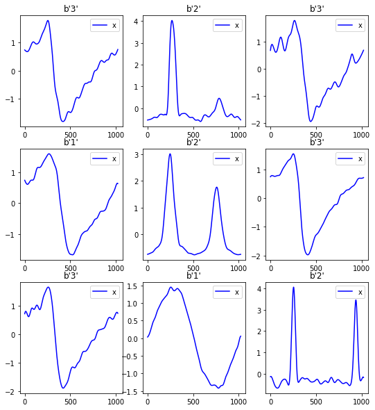

# timeseries_fastai
> This repository aims to implement TimeSeries classification/regression algorithms. It makes extensive use of fastai V2!


> I recommend to use Ignacio's [tsai](https://github.com/timeseriesAI/tsai) for a more complete and robust timeseries fastai based library. It is well documented and implemetns way more models that me here.

## Installation

You will need to install fastai V2 from [here](https://github.com/fastai/fastai) and then you can do from within the environment where you installed fastai V2:

```bash
pip install timeseries_fastai
```

and you are good to go.

### TL;DR
```bash
git clone https://github.com/fastai/fastai
cd fastai
conda env create -f environment.yml
source activate fastai
pip install fastai timeseries_fastai

```

## Time Series Classification from Scratch with Deep Neural Networks: A Strong Baseline
The original paper repo is [here](https://github.com/cauchyturing/UCR_Time_Series_Classification_Deep_Learning_Baseline) is implemented in Keras/Tf.

- Notebook 01: This is a basic notebook that implements the Deep Learning models proposed in [Time Series Classification from Scratch with Deep Neural Networks: A Strong Baseline](https://arxiv.org/abs/1611.06455). 

## InceptionTime: Finding AlexNet for Time SeriesClassification
The original paper repo is [here](https://github.com/hfawaz/InceptionTime)

- Notebook 02: Added InceptionTime architecture from [InceptionTime: Finding AlexNet for Time SeriesClassification](https://arxiv.org/pdf/1909.04939.pdf). 

## Results

You can run the benchmark using:

`$python ucr.py --arch='inception' --tasks='all' --filename='inception.csv' --mixup=0.2`

### Default Values:
- `lr` = 1e-3
- `opt` = 'ranger'
- `epochs` = 40
- `fp16` = True

```python
results_inception = pd.read_csv(Path.cwd().parent/'inception.csv', index_col=0)
display_df(results_inception)
```


<table border="1" class="dataframe">
  <thead>
    <tr style="text-align: right;">
      <th></th>
      <th>acc</th>
      <th>acc_max</th>
      <th>train_loss</th>
      <th>val_loss</th>
    </tr>
    <tr>
      <th>task</th>
      <th></th>
      <th></th>
      <th></th>
      <th></th>
    </tr>
  </thead>
  <tbody>
    <tr>
      <th>ACSF1</th>
      <td>0.82</td>
      <td>0.85</td>
      <td>0.77</td>
      <td>0.62</td>
    </tr>
    <tr>
      <th>Adiac</th>
      <td>0.77</td>
      <td>0.77</td>
      <td>0.81</td>
      <td>0.89</td>
    </tr>
    <tr>
      <th>ArrowHead</th>
      <td>0.70</td>
      <td>0.76</td>
      <td>0.28</td>
      <td>1.21</td>
    </tr>
    <tr>
      <th>BME</th>
      <td>0.85</td>
      <td>0.88</td>
      <td>0.21</td>
      <td>0.79</td>
    </tr>
    <tr>
      <th>Beef</th>
      <td>0.77</td>
      <td>0.83</td>
      <td>0.50</td>
      <td>0.53</td>
    </tr>
    <tr>
      <th>BeetleFly</th>
      <td>0.70</td>
      <td>0.85</td>
      <td>0.14</td>
      <td>0.79</td>
    </tr>
    <tr>
      <th>BirdChicken</th>
      <td>0.95</td>
      <td>0.95</td>
      <td>0.14</td>
      <td>0.20</td>
    </tr>
    <tr>
      <th>CBF</th>
      <td>0.95</td>
      <td>0.97</td>
      <td>0.22</td>
      <td>0.24</td>
    </tr>
    <tr>
      <th>Car</th>
      <td>0.60</td>
      <td>0.68</td>
      <td>0.33</td>
      <td>1.23</td>
    </tr>
    <tr>
      <th>Chinatown</th>
      <td>0.95</td>
      <td>0.96</td>
      <td>0.05</td>
      <td>0.27</td>
    </tr>
    <tr>
      <th>ChlorineConcentration</th>
      <td>0.82</td>
      <td>0.82</td>
      <td>0.28</td>
      <td>0.48</td>
    </tr>
    <tr>
      <th>CinCECGTorso</th>
      <td>0.58</td>
      <td>0.60</td>
      <td>0.42</td>
      <td>1.60</td>
    </tr>
    <tr>
      <th>Coffee</th>
      <td>0.71</td>
      <td>0.82</td>
      <td>0.16</td>
      <td>0.71</td>
    </tr>
    <tr>
      <th>Computers</th>
      <td>0.66</td>
      <td>0.72</td>
      <td>0.24</td>
      <td>0.72</td>
    </tr>
    <tr>
      <th>CricketX</th>
      <td>0.72</td>
      <td>0.73</td>
      <td>0.49</td>
      <td>0.88</td>
    </tr>
    <tr>
      <th>CricketY</th>
      <td>0.71</td>
      <td>0.72</td>
      <td>0.53</td>
      <td>0.84</td>
    </tr>
    <tr>
      <th>CricketZ</th>
      <td>0.77</td>
      <td>0.78</td>
      <td>0.52</td>
      <td>0.79</td>
    </tr>
    <tr>
      <th>Crop</th>
      <td>0.78</td>
      <td>0.78</td>
      <td>0.56</td>
      <td>0.76</td>
    </tr>
    <tr>
      <th>DiatomSizeReduction</th>
      <td>0.93</td>
      <td>0.96</td>
      <td>0.22</td>
      <td>0.22</td>
    </tr>
    <tr>
      <th>DistalPhalanxOutlineAgeGroup</th>
      <td>0.71</td>
      <td>0.75</td>
      <td>0.18</td>
      <td>0.80</td>
    </tr>
    <tr>
      <th>DistalPhalanxOutlineCorrect</th>
      <td>0.74</td>
      <td>0.78</td>
      <td>0.16</td>
      <td>0.57</td>
    </tr>
    <tr>
      <th>DistalPhalanxTW</th>
      <td>0.62</td>
      <td>0.68</td>
      <td>0.27</td>
      <td>1.22</td>
    </tr>
    <tr>
      <th>ECG200</th>
      <td>0.87</td>
      <td>0.91</td>
      <td>0.15</td>
      <td>0.30</td>
    </tr>
    <tr>
      <th>ECG5000</th>
      <td>0.94</td>
      <td>0.94</td>
      <td>0.17</td>
      <td>0.27</td>
    </tr>
    <tr>
      <th>ECGFiveDays</th>
      <td>0.92</td>
      <td>0.94</td>
      <td>0.14</td>
      <td>0.21</td>
    </tr>
    <tr>
      <th>EOGHorizontalSignal</th>
      <td>0.36</td>
      <td>0.40</td>
      <td>0.63</td>
      <td>2.05</td>
    </tr>
    <tr>
      <th>EOGVerticalSignal</th>
      <td>0.37</td>
      <td>0.39</td>
      <td>0.79</td>
      <td>2.00</td>
    </tr>
    <tr>
      <th>Earthquakes</th>
      <td>0.75</td>
      <td>0.75</td>
      <td>0.12</td>
      <td>0.89</td>
    </tr>
    <tr>
      <th>ElectricDevices</th>
      <td>0.71</td>
      <td>0.72</td>
      <td>0.36</td>
      <td>1.20</td>
    </tr>
    <tr>
      <th>EthanolLevel</th>
      <td>0.32</td>
      <td>0.36</td>
      <td>0.61</td>
      <td>1.81</td>
    </tr>
    <tr>
      <th>FaceAll</th>
      <td>0.77</td>
      <td>0.78</td>
      <td>0.46</td>
      <td>0.84</td>
    </tr>
    <tr>
      <th>FaceFour</th>
      <td>0.83</td>
      <td>0.89</td>
      <td>0.29</td>
      <td>0.57</td>
    </tr>
    <tr>
      <th>FacesUCR</th>
      <td>0.83</td>
      <td>0.83</td>
      <td>0.51</td>
      <td>0.73</td>
    </tr>
    <tr>
      <th>FiftyWords</th>
      <td>0.67</td>
      <td>0.69</td>
      <td>0.70</td>
      <td>1.27</td>
    </tr>
    <tr>
      <th>Fish</th>
      <td>0.83</td>
      <td>0.83</td>
      <td>0.45</td>
      <td>1.69</td>
    </tr>
    <tr>
      <th>FordA</th>
      <td>0.95</td>
      <td>0.95</td>
      <td>0.18</td>
      <td>0.13</td>
    </tr>
    <tr>
      <th>FordB</th>
      <td>0.83</td>
      <td>0.85</td>
      <td>0.16</td>
      <td>0.38</td>
    </tr>
    <tr>
      <th>FreezerRegularTrain</th>
      <td>0.98</td>
      <td>0.99</td>
      <td>0.20</td>
      <td>0.10</td>
    </tr>
    <tr>
      <th>FreezerSmallTrain</th>
      <td>0.71</td>
      <td>0.81</td>
      <td>0.21</td>
      <td>1.54</td>
    </tr>
    <tr>
      <th>Fungi</th>
      <td>0.77</td>
      <td>0.85</td>
      <td>0.31</td>
      <td>0.68</td>
    </tr>
    <tr>
      <th>GunPoint</th>
      <td>0.95</td>
      <td>0.97</td>
      <td>0.17</td>
      <td>0.14</td>
    </tr>
    <tr>
      <th>GunPointAgeSpan</th>
      <td>0.97</td>
      <td>0.98</td>
      <td>0.25</td>
      <td>0.08</td>
    </tr>
    <tr>
      <th>GunPointMaleVersusFemale</th>
      <td>1.00</td>
      <td>1.00</td>
      <td>0.17</td>
      <td>0.02</td>
    </tr>
    <tr>
      <th>GunPointOldVersusYoung</th>
      <td>1.00</td>
      <td>1.00</td>
      <td>0.13</td>
      <td>0.01</td>
    </tr>
    <tr>
      <th>Ham</th>
      <td>0.55</td>
      <td>0.66</td>
      <td>0.21</td>
      <td>1.12</td>
    </tr>
    <tr>
      <th>HandOutlines</th>
      <td>0.89</td>
      <td>0.91</td>
      <td>0.25</td>
      <td>0.29</td>
    </tr>
    <tr>
      <th>Haptics</th>
      <td>0.38</td>
      <td>0.43</td>
      <td>0.44</td>
      <td>1.94</td>
    </tr>
    <tr>
      <th>Herring</th>
      <td>0.61</td>
      <td>0.70</td>
      <td>0.19</td>
      <td>0.82</td>
    </tr>
    <tr>
      <th>HouseTwenty</th>
      <td>0.85</td>
      <td>0.88</td>
      <td>0.18</td>
      <td>0.39</td>
    </tr>
    <tr>
      <th>InlineSkate</th>
      <td>0.30</td>
      <td>0.31</td>
      <td>0.95</td>
      <td>2.05</td>
    </tr>
    <tr>
      <th>InsectEPGRegularTrain</th>
      <td>1.00</td>
      <td>1.00</td>
      <td>0.28</td>
      <td>0.08</td>
    </tr>
    <tr>
      <th>InsectEPGSmallTrain</th>
      <td>0.80</td>
      <td>1.00</td>
      <td>0.49</td>
      <td>0.48</td>
    </tr>
    <tr>
      <th>InsectWingbeatSound</th>
      <td>0.55</td>
      <td>0.56</td>
      <td>0.65</td>
      <td>1.27</td>
    </tr>
    <tr>
      <th>ItalyPowerDemand</th>
      <td>0.96</td>
      <td>0.96</td>
      <td>0.14</td>
      <td>0.16</td>
    </tr>
    <tr>
      <th>LargeKitchenAppliances</th>
      <td>0.85</td>
      <td>0.86</td>
      <td>0.28</td>
      <td>0.69</td>
    </tr>
    <tr>
      <th>Lightning2</th>
      <td>0.70</td>
      <td>0.77</td>
      <td>0.18</td>
      <td>0.73</td>
    </tr>
    <tr>
      <th>Lightning7</th>
      <td>0.71</td>
      <td>0.73</td>
      <td>0.46</td>
      <td>1.10</td>
    </tr>
    <tr>
      <th>Mallat</th>
      <td>0.65</td>
      <td>0.66</td>
      <td>0.43</td>
      <td>1.37</td>
    </tr>
    <tr>
      <th>Meat</th>
      <td>0.93</td>
      <td>0.95</td>
      <td>0.25</td>
      <td>0.26</td>
    </tr>
    <tr>
      <th>MedicalImages</th>
      <td>0.72</td>
      <td>0.75</td>
      <td>0.40</td>
      <td>0.85</td>
    </tr>
    <tr>
      <th>MelbournePedestrian</th>
      <td>0.10</td>
      <td>0.10</td>
      <td>nan</td>
      <td>nan</td>
    </tr>
    <tr>
      <th>MiddlePhalanxOutlineAgeGroup</th>
      <td>0.53</td>
      <td>0.60</td>
      <td>0.20</td>
      <td>1.28</td>
    </tr>
    <tr>
      <th>MiddlePhalanxOutlineCorrect</th>
      <td>0.77</td>
      <td>0.81</td>
      <td>0.17</td>
      <td>0.46</td>
    </tr>
    <tr>
      <th>MiddlePhalanxTW</th>
      <td>0.49</td>
      <td>0.59</td>
      <td>0.34</td>
      <td>1.37</td>
    </tr>
    <tr>
      <th>MixedShapesRegularTrain</th>
      <td>0.93</td>
      <td>0.93</td>
      <td>0.35</td>
      <td>0.25</td>
    </tr>
    <tr>
      <th>MixedShapesSmallTrain</th>
      <td>0.80</td>
      <td>0.81</td>
      <td>0.42</td>
      <td>0.64</td>
    </tr>
    <tr>
      <th>MoteStrain</th>
      <td>0.75</td>
      <td>0.76</td>
      <td>0.09</td>
      <td>0.52</td>
    </tr>
    <tr>
      <th>NonInvasiveFetalECGThorax1</th>
      <td>0.92</td>
      <td>0.93</td>
      <td>0.66</td>
      <td>0.32</td>
    </tr>
    <tr>
      <th>NonInvasiveFetalECGThorax2</th>
      <td>0.93</td>
      <td>0.93</td>
      <td>0.59</td>
      <td>0.27</td>
    </tr>
    <tr>
      <th>OSULeaf</th>
      <td>0.82</td>
      <td>0.84</td>
      <td>0.43</td>
      <td>0.58</td>
    </tr>
    <tr>
      <th>OliveOil</th>
      <td>0.77</td>
      <td>0.80</td>
      <td>0.27</td>
      <td>0.74</td>
    </tr>
    <tr>
      <th>PhalangesOutlinesCorrect</th>
      <td>0.81</td>
      <td>0.83</td>
      <td>0.17</td>
      <td>0.46</td>
    </tr>
    <tr>
      <th>Phoneme</th>
      <td>0.22</td>
      <td>0.22</td>
      <td>0.79</td>
      <td>3.25</td>
    </tr>
    <tr>
      <th>PigAirwayPressure</th>
      <td>0.12</td>
      <td>0.14</td>
      <td>2.33</td>
      <td>4.06</td>
    </tr>
    <tr>
      <th>PigArtPressure</th>
      <td>0.47</td>
      <td>0.47</td>
      <td>1.25</td>
      <td>2.25</td>
    </tr>
    <tr>
      <th>PigCVP</th>
      <td>0.30</td>
      <td>0.33</td>
      <td>1.69</td>
      <td>2.97</td>
    </tr>
    <tr>
      <th>Plane</th>
      <td>1.00</td>
      <td>1.00</td>
      <td>0.35</td>
      <td>0.07</td>
    </tr>
    <tr>
      <th>PowerCons</th>
      <td>0.98</td>
      <td>0.98</td>
      <td>0.17</td>
      <td>0.10</td>
    </tr>
    <tr>
      <th>ProximalPhalanxOutlineAgeGroup</th>
      <td>0.83</td>
      <td>0.87</td>
      <td>0.22</td>
      <td>0.53</td>
    </tr>
    <tr>
      <th>ProximalPhalanxOutlineCorrect</th>
      <td>0.88</td>
      <td>0.89</td>
      <td>0.17</td>
      <td>0.34</td>
    </tr>
    <tr>
      <th>ProximalPhalanxTW</th>
      <td>0.78</td>
      <td>0.80</td>
      <td>0.28</td>
      <td>0.78</td>
    </tr>
    <tr>
      <th>RefrigerationDevices</th>
      <td>0.50</td>
      <td>0.56</td>
      <td>0.27</td>
      <td>1.35</td>
    </tr>
    <tr>
      <th>Rock</th>
      <td>0.58</td>
      <td>0.78</td>
      <td>0.29</td>
      <td>1.43</td>
    </tr>
    <tr>
      <th>ScreenType</th>
      <td>0.42</td>
      <td>0.43</td>
      <td>0.33</td>
      <td>1.41</td>
    </tr>
    <tr>
      <th>SemgHandGenderCh2</th>
      <td>0.73</td>
      <td>0.79</td>
      <td>0.21</td>
      <td>0.52</td>
    </tr>
    <tr>
      <th>SemgHandMovementCh2</th>
      <td>0.35</td>
      <td>0.40</td>
      <td>0.43</td>
      <td>1.56</td>
    </tr>
    <tr>
      <th>SemgHandSubjectCh2</th>
      <td>0.52</td>
      <td>0.52</td>
      <td>0.39</td>
      <td>1.13</td>
    </tr>
    <tr>
      <th>ShapeletSim</th>
      <td>0.99</td>
      <td>1.00</td>
      <td>0.14</td>
      <td>0.12</td>
    </tr>
    <tr>
      <th>ShapesAll</th>
      <td>0.80</td>
      <td>0.80</td>
      <td>0.89</td>
      <td>0.83</td>
    </tr>
    <tr>
      <th>SmallKitchenAppliances</th>
      <td>0.65</td>
      <td>0.66</td>
      <td>0.43</td>
      <td>1.60</td>
    </tr>
    <tr>
      <th>SmoothSubspace</th>
      <td>0.96</td>
      <td>0.97</td>
      <td>0.23</td>
      <td>0.15</td>
    </tr>
    <tr>
      <th>SonyAIBORobotSurface1</th>
      <td>0.87</td>
      <td>0.90</td>
      <td>0.08</td>
      <td>0.29</td>
    </tr>
    <tr>
      <th>SonyAIBORobotSurface2</th>
      <td>0.75</td>
      <td>0.79</td>
      <td>0.15</td>
      <td>0.54</td>
    </tr>
    <tr>
      <th>StarLightCurves</th>
      <td>0.98</td>
      <td>0.98</td>
      <td>0.22</td>
      <td>0.09</td>
    </tr>
    <tr>
      <th>Strawberry</th>
      <td>0.97</td>
      <td>0.98</td>
      <td>0.15</td>
      <td>0.09</td>
    </tr>
    <tr>
      <th>SwedishLeaf</th>
      <td>0.94</td>
      <td>0.94</td>
      <td>0.52</td>
      <td>0.27</td>
    </tr>
    <tr>
      <th>Symbols</th>
      <td>0.83</td>
      <td>0.87</td>
      <td>0.39</td>
      <td>0.61</td>
    </tr>
    <tr>
      <th>SyntheticControl</th>
      <td>1.00</td>
      <td>1.00</td>
      <td>0.31</td>
      <td>0.04</td>
    </tr>
    <tr>
      <th>ToeSegmentation1</th>
      <td>0.93</td>
      <td>0.97</td>
      <td>0.16</td>
      <td>0.17</td>
    </tr>
    <tr>
      <th>ToeSegmentation2</th>
      <td>0.88</td>
      <td>0.91</td>
      <td>0.15</td>
      <td>0.27</td>
    </tr>
    <tr>
      <th>Trace</th>
      <td>1.00</td>
      <td>1.00</td>
      <td>0.29</td>
      <td>0.02</td>
    </tr>
    <tr>
      <th>TwoLeadECG</th>
      <td>0.91</td>
      <td>0.92</td>
      <td>0.10</td>
      <td>0.26</td>
    </tr>
    <tr>
      <th>TwoPatterns</th>
      <td>1.00</td>
      <td>1.00</td>
      <td>0.25</td>
      <td>0.01</td>
    </tr>
    <tr>
      <th>UMD</th>
      <td>0.92</td>
      <td>0.94</td>
      <td>0.25</td>
      <td>0.26</td>
    </tr>
    <tr>
      <th>UWaveGestureLibraryAll</th>
      <td>0.91</td>
      <td>0.91</td>
      <td>0.41</td>
      <td>0.31</td>
    </tr>
    <tr>
      <th>UWaveGestureLibraryX</th>
      <td>0.82</td>
      <td>0.82</td>
      <td>0.46</td>
      <td>0.56</td>
    </tr>
    <tr>
      <th>UWaveGestureLibraryY</th>
      <td>0.73</td>
      <td>0.73</td>
      <td>0.50</td>
      <td>0.78</td>
    </tr>
    <tr>
      <th>UWaveGestureLibraryZ</th>
      <td>0.74</td>
      <td>0.74</td>
      <td>0.48</td>
      <td>0.72</td>
    </tr>
    <tr>
      <th>Wafer</th>
      <td>1.00</td>
      <td>1.00</td>
      <td>0.05</td>
      <td>0.01</td>
    </tr>
    <tr>
      <th>Wine</th>
      <td>0.48</td>
      <td>0.63</td>
      <td>0.19</td>
      <td>1.07</td>
    </tr>
    <tr>
      <th>WordSynonyms</th>
      <td>0.62</td>
      <td>0.62</td>
      <td>0.61</td>
      <td>1.60</td>
    </tr>
    <tr>
      <th>Worms</th>
      <td>0.77</td>
      <td>0.78</td>
      <td>0.41</td>
      <td>0.70</td>
    </tr>
    <tr>
      <th>WormsTwoClass</th>
      <td>0.73</td>
      <td>0.81</td>
      <td>0.22</td>
      <td>0.56</td>
    </tr>
    <tr>
      <th>Yoga</th>
      <td>0.86</td>
      <td>0.86</td>
      <td>0.24</td>
      <td>0.33</td>
    </tr>
  </tbody>
</table>


## Getting Started

```python
from timeseries_fastai.imports import *
from timeseries_fastai.core import *
from timeseries_fastai.data import *
from timeseries_fastai.models import *
```

```python
PATH = Path.cwd().parent
```

```python
df_train, df_test = load_df_ucr(PATH, 'Adiac')
```

    Loading files from: /home/tcapelle/SteadySun/timeseries_fastai/Adiac


```python
x_cols = df_train.columns[0:-2].to_list()
```

```python
dls = TSDataLoaders.from_dfs(df_train, df_test, x_cols=x_cols, label_col='target', bs=16)
```

```python
dls.show_batch()
```





```python
inception = create_inception(1, len(dls.vocab))
```

```python
learn = Learner(dls, inception, metrics=[accuracy])
```

```python
learn.fit_one_cycle(1, 1e-3)
```

    epoch     train_loss  valid_loss  accuracy  time    
    0         3.934007    3.640701    0.043478  00:03     

