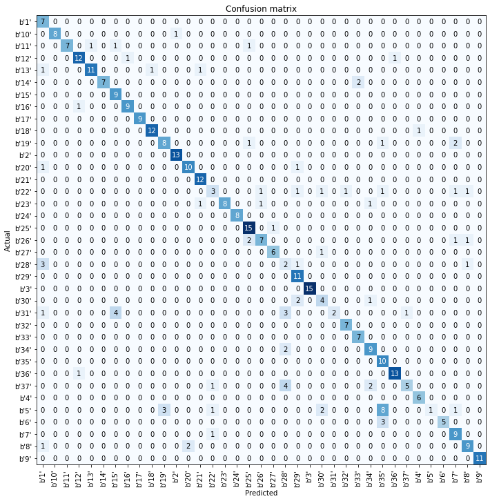

# Title
> summary


# timeseries_fastai

A fastai2 timeseries repo!

## Getting Started

```python
from fastai2.basics import *
from fastai2.callback.all import *
from timeseries_fastai.core import *
from timeseries_fastai.data import *
from timeseries_fastai.models.inception import *
```

```python
ucr_path = untar_data(URLs.UCR)
```

```python
df_train, df_test = load_df_ucr(ucr_path, 'Adiac')
```

    Loading files from: /home/tc256760/.fastai/data/Univariate2018_arff/Adiac


```python
df = stack_train_valid(df_train, df_test)
```

```python
x_cols = df.columns[0:-2].to_list()
```

```python
df
```


<div>
<style scoped>
    .dataframe tbody tr th:only-of-type {
        vertical-align: middle;
    }

    .dataframe tbody tr th {
        vertical-align: top;
    }

    .dataframe thead th {
        text-align: right;
    }
</style>
<table border="1" class="dataframe">
  <thead>
    <tr style="text-align: right;">
      <th></th>
      <th>att1</th>
      <th>att2</th>
      <th>att3</th>
      <th>att4</th>
      <th>att5</th>
      <th>att6</th>
      <th>att7</th>
      <th>att8</th>
      <th>att9</th>
      <th>att10</th>
      <th>...</th>
      <th>att169</th>
      <th>att170</th>
      <th>att171</th>
      <th>att172</th>
      <th>att173</th>
      <th>att174</th>
      <th>att175</th>
      <th>att176</th>
      <th>target</th>
      <th>valid_col</th>
    </tr>
  </thead>
  <tbody>
    <tr>
      <th>0</th>
      <td>1.598007</td>
      <td>1.599439</td>
      <td>1.570529</td>
      <td>1.550474</td>
      <td>1.507371</td>
      <td>1.434341</td>
      <td>1.368986</td>
      <td>1.305294</td>
      <td>1.210305</td>
      <td>1.116653</td>
      <td>...</td>
      <td>1.217175</td>
      <td>1.312530</td>
      <td>1.402920</td>
      <td>1.481043</td>
      <td>1.521012</td>
      <td>1.564154</td>
      <td>1.570855</td>
      <td>1.592890</td>
      <td>b'22'</td>
      <td>False</td>
    </tr>
    <tr>
      <th>1</th>
      <td>1.701146</td>
      <td>1.670645</td>
      <td>1.618884</td>
      <td>1.546805</td>
      <td>1.475469</td>
      <td>1.391209</td>
      <td>1.305882</td>
      <td>1.237313</td>
      <td>1.153414</td>
      <td>1.069690</td>
      <td>...</td>
      <td>1.097360</td>
      <td>1.182578</td>
      <td>1.266291</td>
      <td>1.350571</td>
      <td>1.435160</td>
      <td>1.519737</td>
      <td>1.602518</td>
      <td>1.670190</td>
      <td>b'28'</td>
      <td>False</td>
    </tr>
    <tr>
      <th>2</th>
      <td>1.722342</td>
      <td>1.695329</td>
      <td>1.656946</td>
      <td>1.606312</td>
      <td>1.511824</td>
      <td>1.414148</td>
      <td>1.313688</td>
      <td>1.213234</td>
      <td>1.112978</td>
      <td>1.015081</td>
      <td>...</td>
      <td>1.164750</td>
      <td>1.263924</td>
      <td>1.364303</td>
      <td>1.463511</td>
      <td>1.547307</td>
      <td>1.641809</td>
      <td>1.694973</td>
      <td>1.708488</td>
      <td>b'21'</td>
      <td>False</td>
    </tr>
    <tr>
      <th>3</th>
      <td>1.726263</td>
      <td>1.659836</td>
      <td>1.573108</td>
      <td>1.496264</td>
      <td>1.409070</td>
      <td>1.332443</td>
      <td>1.245742</td>
      <td>1.158882</td>
      <td>1.073361</td>
      <td>0.987165</td>
      <td>...</td>
      <td>1.199608</td>
      <td>1.275380</td>
      <td>1.362258</td>
      <td>1.448567</td>
      <td>1.535131</td>
      <td>1.622158</td>
      <td>1.707838</td>
      <td>1.739027</td>
      <td>b'15'</td>
      <td>False</td>
    </tr>
    <tr>
      <th>4</th>
      <td>1.778976</td>
      <td>1.761203</td>
      <td>1.703084</td>
      <td>1.610572</td>
      <td>1.492088</td>
      <td>1.368654</td>
      <td>1.244761</td>
      <td>1.120900</td>
      <td>1.010762</td>
      <td>0.900168</td>
      <td>...</td>
      <td>1.285657</td>
      <td>1.408878</td>
      <td>1.507983</td>
      <td>1.623643</td>
      <td>1.713606</td>
      <td>1.766389</td>
      <td>1.783633</td>
      <td>1.758625</td>
      <td>b'2'</td>
      <td>False</td>
    </tr>
    <tr>
      <th>...</th>
      <td>...</td>
      <td>...</td>
      <td>...</td>
      <td>...</td>
      <td>...</td>
      <td>...</td>
      <td>...</td>
      <td>...</td>
      <td>...</td>
      <td>...</td>
      <td>...</td>
      <td>...</td>
      <td>...</td>
      <td>...</td>
      <td>...</td>
      <td>...</td>
      <td>...</td>
      <td>...</td>
      <td>...</td>
      <td>...</td>
      <td>...</td>
    </tr>
    <tr>
      <th>776</th>
      <td>1.765127</td>
      <td>1.750026</td>
      <td>1.711097</td>
      <td>1.648484</td>
      <td>1.576266</td>
      <td>1.476857</td>
      <td>1.375652</td>
      <td>1.287533</td>
      <td>1.186471</td>
      <td>1.086855</td>
      <td>...</td>
      <td>1.192923</td>
      <td>1.291224</td>
      <td>1.391377</td>
      <td>1.490076</td>
      <td>1.589615</td>
      <td>1.661466</td>
      <td>1.711183</td>
      <td>1.750479</td>
      <td>b'25'</td>
      <td>True</td>
    </tr>
    <tr>
      <th>777</th>
      <td>1.317664</td>
      <td>1.480770</td>
      <td>1.477460</td>
      <td>1.345680</td>
      <td>1.376355</td>
      <td>1.383122</td>
      <td>1.262999</td>
      <td>1.154494</td>
      <td>1.057933</td>
      <td>0.973615</td>
      <td>...</td>
      <td>1.038177</td>
      <td>0.963510</td>
      <td>1.052633</td>
      <td>1.149836</td>
      <td>1.111965</td>
      <td>1.217966</td>
      <td>1.214703</td>
      <td>1.325830</td>
      <td>b'35'</td>
      <td>True</td>
    </tr>
    <tr>
      <th>778</th>
      <td>1.652000</td>
      <td>1.696799</td>
      <td>1.700560</td>
      <td>1.675451</td>
      <td>1.645406</td>
      <td>1.584621</td>
      <td>1.568612</td>
      <td>1.477382</td>
      <td>1.376073</td>
      <td>1.345743</td>
      <td>...</td>
      <td>1.135803</td>
      <td>1.190241</td>
      <td>1.293052</td>
      <td>1.369039</td>
      <td>1.435152</td>
      <td>1.499251</td>
      <td>1.555716</td>
      <td>1.620383</td>
      <td>b'5'</td>
      <td>True</td>
    </tr>
    <tr>
      <th>779</th>
      <td>1.398673</td>
      <td>1.293392</td>
      <td>1.188837</td>
      <td>1.086091</td>
      <td>0.984476</td>
      <td>0.885808</td>
      <td>0.789724</td>
      <td>0.696206</td>
      <td>0.605575</td>
      <td>0.518136</td>
      <td>...</td>
      <td>1.618150</td>
      <td>1.679640</td>
      <td>1.713751</td>
      <td>1.703014</td>
      <td>1.694377</td>
      <td>1.636338</td>
      <td>1.562648</td>
      <td>1.460544</td>
      <td>b'36'</td>
      <td>True</td>
    </tr>
    <tr>
      <th>780</th>
      <td>1.727172</td>
      <td>1.728359</td>
      <td>1.693759</td>
      <td>1.642345</td>
      <td>1.582616</td>
      <td>1.515496</td>
      <td>1.403261</td>
      <td>1.287341</td>
      <td>1.168944</td>
      <td>1.048659</td>
      <td>...</td>
      <td>1.097731</td>
      <td>1.218005</td>
      <td>1.336483</td>
      <td>1.451600</td>
      <td>1.554501</td>
      <td>1.627295</td>
      <td>1.675343</td>
      <td>1.698931</td>
      <td>b'10'</td>
      <td>True</td>
    </tr>
  </tbody>
</table>
<p>781 rows × 178 columns</p>
</div>


```python
dls = TSDataLoaders.from_df(df, x_cols=x_cols, label_col='target', valid_col='valid_col')
```

```python
inception = create_inception(1, 37)
```

```python
learn = Learner(dls, inception, metrics=[accuracy])
```

```python
learn.fit_one_cycle(25, 1e-3)
```


<table border="1" class="dataframe">
  <thead>
    <tr style="text-align: left;">
      <th>epoch</th>
      <th>train_loss</th>
      <th>valid_loss</th>
      <th>accuracy</th>
      <th>time</th>
    </tr>
  </thead>
  <tbody>
    <tr>
      <td>0</td>
      <td>4.542264</td>
      <td>3.617529</td>
      <td>0.030691</td>
      <td>00:02</td>
    </tr>
    <tr>
      <td>1</td>
      <td>4.136417</td>
      <td>3.625725</td>
      <td>0.030691</td>
      <td>00:02</td>
    </tr>
    <tr>
      <td>2</td>
      <td>3.854969</td>
      <td>3.637391</td>
      <td>0.030691</td>
      <td>00:02</td>
    </tr>
    <tr>
      <td>3</td>
      <td>3.607037</td>
      <td>3.640668</td>
      <td>0.030691</td>
      <td>00:02</td>
    </tr>
    <tr>
      <td>4</td>
      <td>3.392601</td>
      <td>3.579307</td>
      <td>0.071611</td>
      <td>00:02</td>
    </tr>
    <tr>
      <td>5</td>
      <td>3.203232</td>
      <td>3.328092</td>
      <td>0.127877</td>
      <td>00:02</td>
    </tr>
    <tr>
      <td>6</td>
      <td>3.048132</td>
      <td>2.932842</td>
      <td>0.225064</td>
      <td>00:02</td>
    </tr>
    <tr>
      <td>7</td>
      <td>2.881940</td>
      <td>2.600225</td>
      <td>0.271100</td>
      <td>00:02</td>
    </tr>
    <tr>
      <td>8</td>
      <td>2.718797</td>
      <td>2.178436</td>
      <td>0.388747</td>
      <td>00:02</td>
    </tr>
    <tr>
      <td>9</td>
      <td>2.549301</td>
      <td>2.019035</td>
      <td>0.381074</td>
      <td>00:02</td>
    </tr>
    <tr>
      <td>10</td>
      <td>2.392547</td>
      <td>1.675599</td>
      <td>0.488491</td>
      <td>00:02</td>
    </tr>
    <tr>
      <td>11</td>
      <td>2.241712</td>
      <td>2.142292</td>
      <td>0.360614</td>
      <td>00:02</td>
    </tr>
    <tr>
      <td>12</td>
      <td>2.105224</td>
      <td>1.619634</td>
      <td>0.511509</td>
      <td>00:02</td>
    </tr>
    <tr>
      <td>13</td>
      <td>1.972625</td>
      <td>1.382407</td>
      <td>0.567775</td>
      <td>00:02</td>
    </tr>
    <tr>
      <td>14</td>
      <td>1.853862</td>
      <td>1.456197</td>
      <td>0.534527</td>
      <td>00:02</td>
    </tr>
    <tr>
      <td>15</td>
      <td>1.734383</td>
      <td>1.211880</td>
      <td>0.631714</td>
      <td>00:02</td>
    </tr>
    <tr>
      <td>16</td>
      <td>1.622275</td>
      <td>1.073925</td>
      <td>0.708440</td>
      <td>00:02</td>
    </tr>
    <tr>
      <td>17</td>
      <td>1.515192</td>
      <td>1.048840</td>
      <td>0.667519</td>
      <td>00:02</td>
    </tr>
    <tr>
      <td>18</td>
      <td>1.416882</td>
      <td>0.974738</td>
      <td>0.769821</td>
      <td>00:02</td>
    </tr>
    <tr>
      <td>19</td>
      <td>1.328363</td>
      <td>0.981020</td>
      <td>0.723785</td>
      <td>00:02</td>
    </tr>
    <tr>
      <td>20</td>
      <td>1.248659</td>
      <td>0.984357</td>
      <td>0.736573</td>
      <td>00:02</td>
    </tr>
    <tr>
      <td>21</td>
      <td>1.172296</td>
      <td>0.977382</td>
      <td>0.744246</td>
      <td>00:02</td>
    </tr>
    <tr>
      <td>22</td>
      <td>1.103067</td>
      <td>0.903992</td>
      <td>0.772379</td>
      <td>00:02</td>
    </tr>
    <tr>
      <td>23</td>
      <td>1.040495</td>
      <td>0.895779</td>
      <td>0.785166</td>
      <td>00:02</td>
    </tr>
    <tr>
      <td>24</td>
      <td>0.984594</td>
      <td>0.893522</td>
      <td>0.785166</td>
      <td>00:02</td>
    </tr>
  </tbody>
</table>


```python
interp = ClassificationInterpretation.from_learner(learn)
```


```python
interp.plot_confusion_matrix(figsize=(10,10))
```




